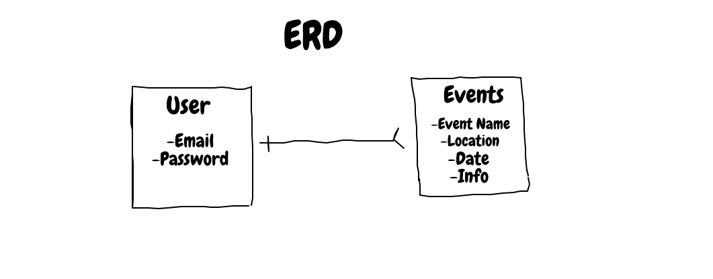

# Event Planner

The Event Planner is a front end application built using React where signed in users are able to create, edit, and delete events to their planner.

## Planning Process
  My first approach on creating the application consisted of creating the ERD and the Wireframe to have a visualization of the functionalities of the application. From there, I started to work on the API and tested the CRUD actions with curl scripts.

  ## User Stories
   - As a user, I want to be able to sign-up
   - As a user, I want to be able to sign-in
   - As a user, I want to be able to change password
   - As a user, I want to be able to sign-out
   - As a user, I would like success/failure messages when I have completed an auth action.
   - As a user, I would like to create an event
   - As a  user, I would like to view all events
   - As a user, I would like to edit an event
   - As a user, I would like to delete an event

## Technologies
  - Express
  - MongoDB
  - Heroku
  - Mongoose
  - Postman

## Setup
  1. Fork & Clone or download this repository
  2. Install dependencies with `npm install`
  3. Run local server with `nodemon run server`

### API Routes and Paths
  | Verb   | URI Pattern            | Controller#Action |
  |--------|------------------------|-------------------|
  | POST   | `/sign-up`             | `users#signup`    |
  | POST   | `/sign-in`             | `users#signin`    |
  | DELETE | `/sign-out`            | `users#signout`   |
  | PATCH  | `/change-password`     | `users#changepw`  |
  | POST   | `/create-event`         | `event#create`     |
  | GET    | `/events`               | `eventss#index`     |
  | GET    | `/events/:id`           | `eventss#show`      |
  | PATCH  | `/events/:id/edit`      | `events#update`    |
  | DELETE | `/events/:id/`          | `events#delete`    |

  ## Links
  - Deployed Front-End Client:https://ajamcato.github.io/capstone-client/
  - Front-End Client Repository: https://github.com/ajamcato/capstone-client
  - Deployed Back-End API: https://morning-reef-49097.herokuapp.com/
  - Back-End API repository: https://github.com/ajamcato/capstone-api

